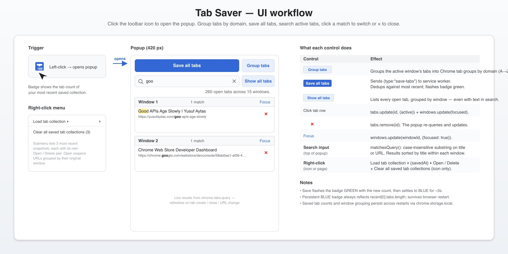

# Tab Saver

Chrome extension (Manifest V3). Click the toolbar icon to open a popup that lets you save every open tab across every Chrome window, group the active window's tabs into Chrome tab groups by domain, search your currently open tabs (click a result to switch, or the **×** to close it), or jump to the right-click "Load tab collection" submenu to reopen a saved snapshot.

Sources are in `src/` (`background.ts`, `popup.ts`, helpers in `lib.ts`); they compile to `dist/*.js`, which is what Chrome actually loads. There's no bundler — just `tsc`.



> The diagram is a single-panel walk-through of the current popup: how the toolbar icon opens it, what the Save button and search input do, how clicking a result row switches to that tab while the **×** / Focus controls call into the Chrome API, and how the right-click menu still surfaces saved collections. Source SVG lives at `assets/ui-workflows.svg`.

## Installation

### 1. Install build dependencies (first time only)

You need [Node.js](https://nodejs.org/) (with `npm`) installed.

```sh
npm install
```

Installs `typescript`, `@types/chrome`, and `vitest` into `node_modules/`. Nothing is installed globally.

### 2. Build

```sh
npm run build       # one-shot tsc compile
npm run watch       # tsc --watch during active development
```

Output: `dist/background.js`, `dist/popup.js`, and `dist/lib.js`. `tsconfig.json` targets `outDir: ./dist` and excludes test files so `dist/` stays Chrome-loadable.

### 3. Load the unpacked extension into Chrome

1. Open `chrome://extensions` in Chrome.
2. Toggle **Developer mode** on (top-right).
3. Click **Load unpacked**.
4. Select the directory **containing `manifest.json`** — the package root (not `dist/`). The manifest's `service_worker` points to `dist/background.js`, so Chrome loads the compiled output.

The extension's icon should appear in the toolbar. Pin it if you want it always visible.

### 4. Reload after changes

After every build, click the circular reload icon on the extension's card at `chrome://extensions`. Service-worker logs are under the **Inspect views: service worker** link on the same card.

> If you change `manifest.json` (especially `permissions`), a plain reload may not be enough — remove and re-load the unpacked extension so Chrome picks up the new permissions.

## Features

- **Save from the toolbar popup.** Click the toolbar icon to open a small popup with a "Save all tabs" button at the top. One click captures every tab in every Chrome window into a single collection (URL, title, original window). A desktop notification confirms the save and the badge updates.
- **Group active-window tabs by domain.** A **Group tabs** button sits to the right of "Save all tabs". One click sorts the **current window's** unpinned tabs into native Chrome tab groups — one group per domain (with `www.` stripped, so `www.github.com` and `github.com` merge), arranged alphabetically left-to-right and titled with the domain. The button briefly shows how many domains were grouped. Pinned tabs and non-web URLs (e.g. `chrome://`, `about:blank`) are left ungrouped. Grouping is idempotent: domains already correctly grouped (one group, matching title, exactly those tabs) are skipped so existing group colors and collapsed state are preserved — the button shows "Already grouped" when there's nothing to do.
- **Persistent badge with the latest count.** A blue badge on the toolbar icon shows the number of tabs in your **most recent** saved collection. It survives browser restarts and updates whenever you save, delete, or clear. Right after a save the badge briefly flashes **green** for 3 seconds, then settles back to blue.
- **Skip duplicate saves.** If your tab list (URLs and order) is identical to the most recent saved collection, **Save all tabs** is a no-op — the button shows "Already saved", no new entry is added, and no notification fires. Repeated saves won't pollute history.
- **Right-click to manage a collection.** The "Load tab collection" submenu lists your **3 most recent** snapshots (most recent first), each labeled with its save timestamp and tab count. Each entry expands into an **Open** / **Delete** submenu — Open reopens the URLs as new windows (**preserving the original multi-window grouping**, so a save that spanned three windows reopens as three windows); Delete removes just that entry from storage.
- **Search active tabs from the popup.** The same toolbar popup includes a search input that filters your **currently open** tabs by title or URL (case-insensitive substring). Results are grouped into one boxed card per Chrome window (each with a **Focus** button in its header). **Click a result row** to switch to that tab and focus its window, or click the red **×** to close the tab in place. Useful when you have dozens of tabs across multiple windows and need to jump to a specific one without scanning visually.
- **One-click clear.** Right-click the extension **icon** → "Clear all saved tab collections (N)" wipes every saved collection and clears the badge. The menu item is disabled when there's nothing to clear.
- **Storage caps.** Up to **1000 collections** are kept, and the entire `recent` array is trimmed (oldest first) to stay under **~1 MiB** when serialized. The most recent save is always kept, even if it would push you over the limit.
- **Visible storage location.** The post-save notification tells you that data lives in `chrome.storage.local` (browser-internal, not a regular file) and includes the on-disk path Chrome uses on macOS. Useful when you're wondering "where did that go?"
- **Persists across browser restarts.** Collections live in `chrome.storage.local`, so they survive Chrome restarts and the MV3 service worker being suspended between clicks.

> **Visibility vs. storage.** The right-click submenu only shows the 3 most recent collections, but older entries (up to the storage caps) still live in `chrome.storage.local`. They aren't surfaced in the UI today; you'd see them via DevTools or by extending the extension to render more.

## Usage

- **Save** — click the toolbar icon to open the popup, then click **Save all tabs**. Every tab in every Chrome window is captured into a single collection. The toolbar badge flashes green for 3 seconds with the new collection's tab count, then settles back to blue. A desktop notification confirms the save and points to where the data lives (`chrome.storage.local`, browser-internal — not a regular file). If the URL list (in order) is identical to your most recent save, the button shows "Already saved" and nothing new is recorded.
- **Group tabs** — click **Group tabs** (right of "Save all tabs") to sort the current window's unpinned tabs into native Chrome tab groups by domain, ordered alphabetically. The button confirms with the number of domains grouped, or "Already grouped" if nothing changed.
- **Search active tabs** — the popup's search input filters your currently open tabs by title or URL. Results are grouped into one boxed card per Chrome window. Click a result row to switch to that tab in its window; click the red **×** to close the tab.
- **Reopen** — right-click anywhere on a page (or on the extension icon) → **Load tab collection** → pick a snapshot → **Open**. URLs are reopened grouped by their original window, so a multi-window save round-trips as multiple windows.
- **Delete one entry** — same path: **Load tab collection** → pick a snapshot → **Delete**. Removes only that entry; the badge updates to the new most-recent collection's count (or clears if nothing's left).
- **Clear all** — right-click the extension **icon** (action menu only) → **Clear all saved tab collections (N)**. One click wipes every saved collection and clears the badge.

## Developer

### Layout

```
tab-saver/
├── manifest.json              ← Chrome extension manifest (MV3)
├── popup.html                 ← Toolbar popup (Group + Save buttons + active-tab search)
├── src/
│   ├── background.ts          ← Service-worker entry: chrome.* listeners, menu rebuild, badge, save handler
│   ├── popup.ts               ← Popup UI (renders open tabs, filters, click-to-switch / × close)
│   ├── lib.ts                 ← Pure helpers (sameUrls, trim, nextRecent, matchesQuery, …)
│   └── __tests__/lib.spec.ts  ← Vitest tests for lib.ts
├── dist/                      ← Compiled output. Loaded by Chrome. Don't edit by hand.
│   ├── background.js
│   ├── popup.js
│   └── lib.js
├── assets/
│   ├── icon.png               ← Toolbar icon (referenced by manifest.json)
│   ├── ui-workflows.jpg       ← Rendered diagram for README
│   └── ui-workflows.svg       ← Source for ui-workflows.jpg
├── tsconfig.json              ← Strict TS, ES2022, DOM + chrome types; excludes tests
└── package.json               ← npm scripts: build, watch, test
```

`tsconfig.json` includes `src/**/*.ts` but **excludes** `src/__tests__/**`, so test files don't end up in the compiled output that Chrome loads. Vitest uses its own transform path.

### npm scripts

| Command           | What it does                                              |
| ----------------- | --------------------------------------------------------- |
| `npm run build`   | One-shot `tsc` compile. Run before testing in Chrome.     |
| `npm run watch`   | `tsc --watch`. Use during active development.             |
| `npm test`        | Run vitest once and exit (CI-style).                      |

### Where to add code

- **Pure logic** (decision functions, predicates, data transforms) → `src/lib.ts`. Add a test in `src/__tests__/lib.spec.ts` next to it.
- **Service-worker / Chrome API wiring** (event listeners, badge/notification side effects, context-menu rebuilds, message handlers) → `src/background.ts`. Keep listeners thin; defer to helpers in `lib.ts` for any non-trivial decision.
- **Popup UI** (DOM rendering, search input, tab actions like click-to-switch and the × close button, save button) → `src/popup.ts`. The popup talks to the service worker via `chrome.runtime.sendMessage` for anything that touches storage (e.g., `{ type: "save-tabs" }`).

This split is intentional: `lib.ts` is testable without mocking `chrome.*`, `background.ts` stays small enough to read top-to-bottom, and `popup.ts` owns nothing that needs to survive the popup closing.

### Service-worker quirks

The MV3 service worker is short-lived — Chrome can suspend it between events. State that needs to outlive a single click goes in `chrome.storage.local`. Don't rely on module-level variables for persistence (anything you stash in a `let` may be gone by the next event).

When debugging, the **Inspect views: service worker** link on `chrome://extensions` opens DevTools attached to the worker. If the link reads "(inactive)", click the extension icon once to wake it.

### Testing

Tests run on Node — no Chrome required. They cover only the pure helpers in `lib.ts`. To add a test:

```sh
# Run a single test file
npx vitest run src/__tests__/lib.spec.ts

# Watch mode while editing
npx vitest
```

Listener-level tests (mocking `chrome.*`) aren't set up. The bulk of decision logic lives in `lib.ts`; if you push more logic into `background.ts`, consider extracting it back so it stays testable.

### Shipping a change

1. `npm run build` (or have `npm run watch` running).
2. `npm test` — make sure helpers still pass.
3. Click reload on the extension's `chrome://extensions` card.
4. Open the popup and the service-worker DevTools, and exercise the change. Save (button), search-and-click-to-switch, search-and-× -close, reopen, delete-one, and clear-all all hit different code paths; the badge should stay in sync with `recent[0]`. To debug `popup.ts`, right-click inside the open popup → **Inspect** opens DevTools attached to the popup page (separate from the service worker).
